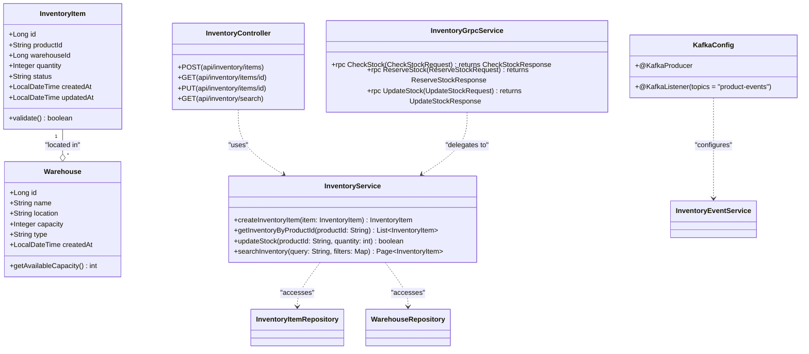

# Inventory Service

## Overview

The Inventory Service is a Spring Boot-based microservice responsible for managing stock levels, warehouse operations, and inventory tracking for an e-commerce platform. It provides CRUD operations for inventory items, warehouse management, advanced search and filtering capabilities, and integrates with other services through gRPC and Apache Kafka for asynchronous event-driven communication.

Key features:

- **Inventory Management**: Track stock quantities, locations, and status
- **Warehouse Management**: Manage multiple warehouse locations and capacities
- **Real-time Stock Updates**: Handle stock adjustments via events
- **Search & Filtering**: Advanced search across inventory items with pagination
- **gRPC Integration**: Synchronous communication with other services (e.g., Product Service)
- **Kafka Event Streaming**: Asynchronous notifications for inventory changes
- **REST API**: Comprehensive HTTP endpoints for external integration

Technology Stack:

- **Language**: Java 17
- **Framework**: Spring Boot 3.1.0
- **Database**: PostgreSQL with Spring Data JPA
- **Communication**: gRPC, Apache Kafka
- **Caching**: Redis
- **Documentation**: OpenAPI/Swagger
- **Monitoring**: Spring Actuator, Micrometer Prometheus
- **Containerization**: Docker
- **Orchestration**: Kubernetes (deployment manifests included)

## Setup Instructions

### Prerequisites

- Java 17 JDK
- Maven 3.8+
- Docker and Docker Compose
- PostgreSQL 13+
- Redis 7+
- Apache Kafka 3.6+
- Kubernetes (optional, for production deployment)

### Local Development Setup

1. **Clone the Repository**

   ```bash
   git clone <repository-url>
   cd inventory-service
   ```

2. **Database Configuration**
   Update `src/main/resources/application.yml` with your database credentials:

   ```yaml
   spring:
     datasource:
       url: jdbc:postgresql://localhost:5432/inventory_db
       username: your_username
       password: your_password
     jpa:
       hibernate:
         ddl-auto: update
       show-sql: true
   ```

3. **Redis Configuration**
   Ensure Redis is running on localhost:6379 (default).

4. **Kafka Configuration**
   Update Kafka bootstrap servers in `application.yml`:

   ```yaml
   spring:
     kafka:
       bootstrap-servers: localhost:9092
   ```

5. **Build the Project**

   ```bash
   mvn clean install
   ```

6. **Run the Application**

   ```bash
   mvn spring-boot:run
   ```

   The service will start on port 8084.

7. **Access Swagger UI**
   Open `http://localhost:8084/swagger-ui.html` for API documentation.

### Docker Setup

1. **Build Docker Image**

   ```bash
   mvn clean package
   docker build -t inventory-service:latest .
   ```

2. **Run with Docker Compose**
   Use the provided `docker-compose.yml` in the root directory:

   ```bash
   docker-compose up -d
   ```

3. **Kubernetes Deployment**
   Apply the deployment manifest:

   ```bash
   kubectl apply -f k8s/inventory-deployment.yaml
   ```

### Database Schema

The service uses JPA with automatic schema generation. Key tables:

- **inventory_items**: Stores product stock details (id, product_id, warehouse_id, quantity, status)
- **warehouses**: Stores warehouse information (id, name, location, capacity)

Run migrations if using Flyway or Liquibase (not currently configured).

## Architecture

The Inventory Service follows a layered architecture pattern with clean separation of concerns:

### Layered Architecture

- **Controller Layer**: REST and gRPC endpoints
- **Service Layer**: Business logic, search, pagination, event handling
- **Repository Layer**: Data access with JPA
- **Model Layer**: Entity classes with validation
- **Configuration Layer**: Kafka, Redis, gRPC setup
- **Cross-cutting Concerns**: Exception handling, security, monitoring

### Key Components

1. **Inventory Management**: Core CRUD operations for inventory items
2. **Warehouse Management**: Location-based stock distribution
3. **Search Service**: Advanced search with full-text capabilities
4. **Pagination Service**: Efficient data retrieval for large datasets
5. **Event Service**: Kafka-based event publishing and consumption
6. **gRPC Service**: Synchronous communication interface

### Technology Integration

- **Spring Data JPA**: ORM for database operations
- **Spring Kafka**: Event-driven architecture
- **gRPC**: High-performance RPC framework
- **Redis**: Caching layer for frequently accessed data
- **Spring Actuator**: Health checks and metrics
- **SpringDoc OpenAPI**: API documentation

## API Endpoints

### REST API (Port 8084)

#### Inventory Items

- `POST /api/inventory/items` - Create new inventory item
- `GET /api/inventory/items/{id}` - Get inventory item by ID
- `PUT /api/inventory/items/{id}` - Update inventory item
- `DELETE /api/inventory/items/{id}` - Delete inventory item
- `GET /api/inventory/items` - List all inventory items with search/filter/pagination

#### Warehouses

- `POST /api/warehouses` - Create warehouse
- `GET /api/warehouses/{id}` - Get warehouse by ID
- `PUT /api/warehouses/{id}` - Update warehouse
- `GET /api/warehouses` - List all warehouses

#### Search & Filter

- `GET /api/inventory/search?q={query}&category={category}&minQuantity={min}` - Advanced search
- `GET /api/inventory/filter?status={status}&warehouseId={id}` - Filtered results

### gRPC Endpoints

Defined in `src/main/proto/inventory.proto`:

- `CheckStock(productId: string, warehouseId: string) returns StockResponse`
- `ReserveStock(request: ReserveRequest) returns ReserveResponse`
- `UpdateStock(productId: string, quantity: int32) returns UpdateResponse`

## Interaction with Product Service

The Inventory Service integrates with the Product Service through multiple communication patterns:

### 1. Synchronous Integration (gRPC)

The Product Service calls the Inventory Service for real-time stock validation during:

- **Product Creation**: Validate SKU availability in inventory
- **Product Updates**: Update stock levels when product details change
- **Stock Checks**: Real-time availability during checkout process
- **Reservation**: Temporary stock reservation for orders

### 2. Asynchronous Integration (Kafka Events)

Event-driven communication for:

- **Product Created Event**: Inventory Service creates initial stock record
- **Product Updated Event**: Synchronize inventory metadata changes
- **Product Deleted Event**: Remove associated inventory records
- **Stock Adjustment Events**: Handle stock movements and corrections
- **Low Stock Alerts**: Notify when stock levels reach threshold

### 3. Data Synchronization

- **Product Reference**: Inventory items reference product IDs from Product Service
- **SKU Synchronization**: Ensure SKU consistency across services
- **Category Mapping**: Map product categories to inventory locations
- **Price Updates**: Reflect product price changes in inventory valuation

### Integration Flow

When a product is created in the Product Service:

1. Product Service publishes `ProductCreatedEvent` to Kafka
2. Inventory Service consumes the event and creates initial inventory item
3. Product Service calls gRPC `CheckStock` to validate availability
4. Both services maintain eventual consistency through event sourcing

## Architecture Diagrams

### Class Diagram



### Sequence Diagram - Product Creation Flow


### Component Diagram - Microservices Architecture


### Deployment Architecture


## Event-Driven Architecture

### Published Events

- `InventoryItemCreatedEvent`: New inventory item added
- `InventoryItemUpdatedEvent`: Stock level changed
- `InventoryItemDeletedEvent`: Inventory item removed
- `LowStockAlertEvent`: Stock below threshold
- `StockReservationEvent`: Stock reserved for order

### Consumed Events

- `ProductCreatedEvent`: Create initial inventory record
- `ProductUpdatedEvent`: Update inventory metadata
- `ProductDeletedEvent`: Remove inventory records
- `OrderCreatedEvent`: Reserve stock for new order
- `OrderCancelledEvent`: Release reserved stock

## Performance Considerations

- **Caching**: Redis cache for frequent stock queries
- **Database Indexing**: Composite indexes on (product_id, warehouse_id)
- **Async Processing**: Kafka consumers for non-critical operations
- **Connection Pooling**: HikariCP for database connections
- **gRPC Streaming**: For bulk operations and real-time updates
- **Pagination**: Offset-based pagination with search optimization

## Testing

### Unit Tests

- Service layer tests with Mockito
- Repository tests with @DataJpaTest
- Controller integration tests

### Integration Tests

- End-to-end API tests with Testcontainers
- Kafka integration tests
- gRPC service tests

Run tests:

```bash
mvn test
```

Coverage report:

```bash
mvn jacoco:report
```

## Monitoring and Health Checks

### Actuator Endpoints

- `/actuator/health` - Health status
- `/actuator/metrics` - Performance metrics
- `/actuator/prometheus` - Prometheus metrics
- `/actuator/info` - Service information

### Custom Metrics

- Stock update latency
- gRPC request duration
- Kafka consumer lag
- Cache hit/miss ratio

## Security

- **Authentication**: JWT tokens via API Gateway
- **Authorization**: Role-based access control
- **Rate Limiting**: Configured via Spring Cloud Gateway
- **Input Validation**: Bean Validation annotations
- **SQL Injection Prevention**: JPA parameterized queries
- **CORS**: Configured for frontend integration

## Deployment

### Docker

See `Dockerfile` for container configuration. Exposes port 8084.

### Kubernetes

- `k8s/inventory-deployment.yaml`: Deployment with 3 replicas
- Resource limits: 1CPU, 2GB memory
- Health checks via Actuator
- ConfigMaps for environment variables
- Secrets for database credentials

### CI/CD Pipeline

Recommended Jenkins/GitHub Actions pipeline:

1. Build and test
2. Docker image build and push
3. Kubernetes deployment
4. Integration tests
5. Performance monitoring

## Troubleshooting

### Common Issues

1. **Database Connection Failed**
   - Check `application.yml` database credentials
   - Verify PostgreSQL is running
   - Check network connectivity

2. **Kafka Connection Issues**
   - Verify Kafka brokers are accessible
   - Check topic existence and permissions
   - Review consumer group configuration

3. **gRPC Errors**
   - Ensure protobuf definitions are synchronized
   - Check service discovery (if using)
   - Verify network policies in Kubernetes

4. **High Latency**
   - Monitor database query performance
   - Check Redis cache hit rate
   - Review Kafka consumer lag

### Logs

Application logs are written to stdout. Use:

```bash
docker logs inventory-service
```

For structured logging, integrate with ELK stack.

## Contributing

1. Fork the repository
2. Create feature branch (`git checkout -b feature/AmazingFeature`)
3. Commit changes (`git commit -m 'Add some AmazingFeature'`)
4. Push to branch (`git push origin feature/AmazingFeature`)
5. Open Pull Request

Please follow:

- Java code style (Google Java Format)
- Comprehensive unit tests
- API documentation updates
- Performance impact analysis for major changes

## License

This project is licensed under the Apache License 2.0 - see the [LICENSE](LICENSE) file for details.

---

*Version 0.0.1-SNAPSHOT | Last Updated: September 2025*
