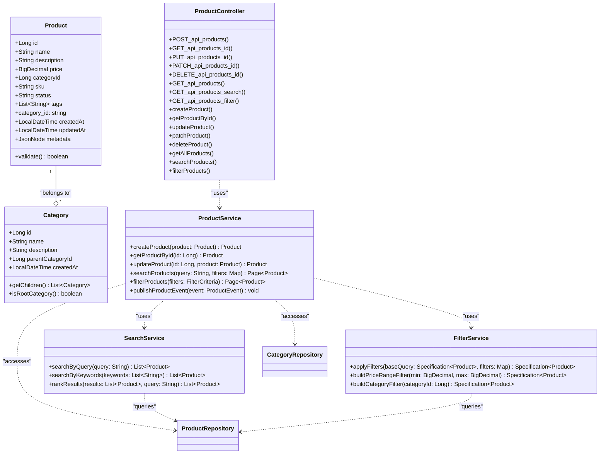
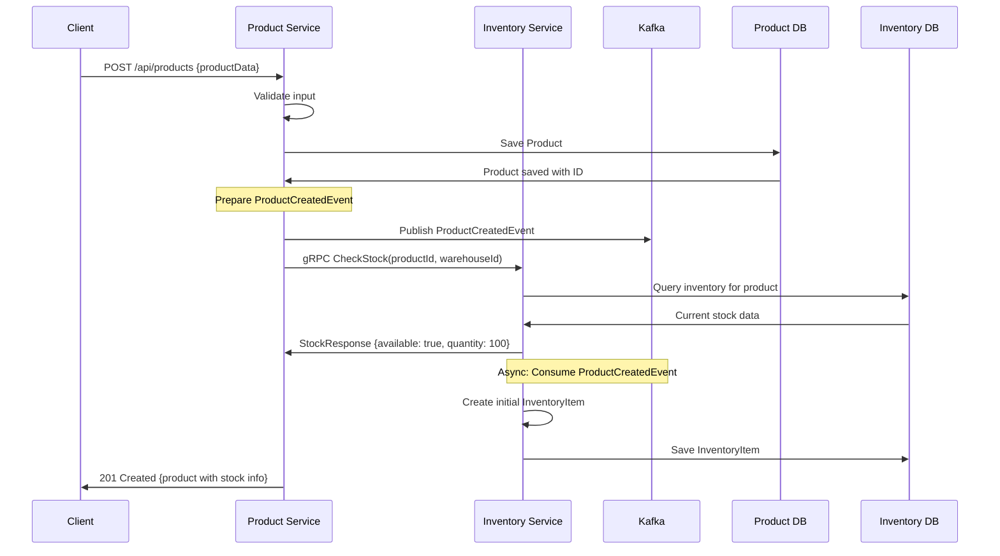
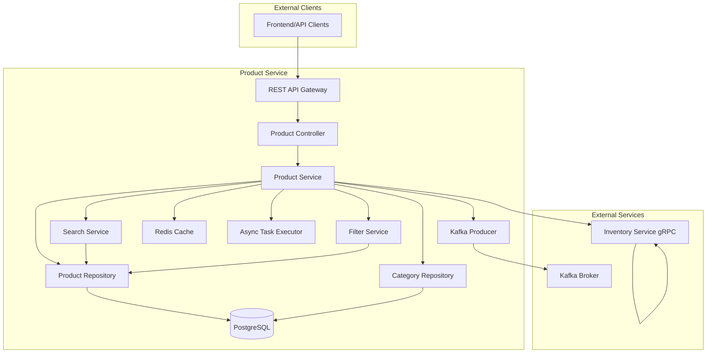
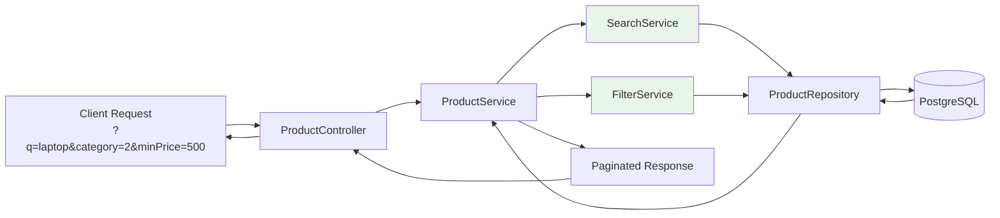

# Product Service

## Overview

The Product Service is a Spring Boot-based microservice responsible for managing product catalog, categories, and product metadata for an e-commerce platform. It provides comprehensive CRUD operations, advanced search and filtering capabilities, and integrates with other services like Inventory Service for stock management through gRPC and Apache Kafka.

### Key features

- **Product Management**: Full CRUD operations for products and categories
- **Advanced Search**: Full-text search across product attributes
- **Filtering System**: Multi-criteria filtering by price, category, status, etc.
- **Pagination & Sorting**: Efficient data retrieval for large catalogs
- **Event-Driven Architecture**: Kafka integration for product lifecycle events
- **REST API**: Comprehensive HTTP endpoints with OpenAPI documentation
- **Performance Optimization**: Caching, async processing, and database optimization

### Technology Stack

- **Language**: Java 17
- **Framework**: Spring Boot 3.1.0
- **Database**: PostgreSQL with Spring Data JPA
- **Search & Filtering**: Custom service layer implementation
- **Documentation**: OpenAPI/Swagger
- **Monitoring**: Spring Actuator, Micrometer Prometheus
- **Async Processing**: Spring Async
- **HATEOAS**: RESTful hypermedia links

## Setup Instructions

### Prerequisites

- Java 17 JDK
- Maven 3.8+
- Docker and Docker Compose
- PostgreSQL 13+

### Local Development Setup

1. **Clone the Repository**

   ```bash
   git clone <repository-url>
   cd product-service
   ```

2. **Database Configuration**
   Update `src/main/resources/application.yml` with your database credentials:

   ```yaml
   spring:
     datasource:
       url: jdbc:postgresql://localhost:5432/product_db
       username: your_username
       password: your_password
     jpa:
       hibernate:
         ddl-auto: update
       show-sql: true
   ```

3. **Build the Project**

   ```bash
   mvn clean install
   ```

4. **Run the Application**

   ```bash
   mvn spring-boot:run
   ```

   The service will start on port 8080 (default).

5. **Access Swagger UI**
   Open `http://localhost:8080/swagger-ui.html` for API documentation.

### Docker Setup

1. **Create Dockerfile** (if not exists)

   ```dockerfile
   FROM openjdk:17-jdk-slim
   WORKDIR /app
   COPY target/*.jar app.jar
   EXPOSE 8080
   ENTRYPOINT ["java", "-jar", "app.jar"]
   ```

2. **Build Docker Image**

   ```bash
   mvn clean package
   docker build -t product-service:latest .
   ```

3. **Run Container**

   ```bash
   docker run -p 8080:8080 --env SPRING_DATASOURCE_URL=jdbc:postgresql://host.docker.internal:5432/product_db product-service:latest
   ```

### Database Schema

The service uses JPA with automatic schema generation. Key tables:

- **products**: Stores product information (id, name, description, price, category_id, sku, status, tags, created_at, updated_at)
- **categories**: Stores category hierarchy (id, name, description, parent_category_id)

Run migrations if using Flyway or Liquibase (not currently configured).

## Architecture

The Product Service follows a layered architecture with clean separation of concerns:

### Layered Architecture

- **Controller Layer**: REST endpoints with HATEOAS support
- **Service Layer**: Business logic, search, filtering, pagination
- **Repository Layer**: Data access with JPA repositories
- **Model Layer**: Entity classes with validation and relationships
- **Configuration Layer**: Async processing, OpenAPI setup
- **Cross-cutting Concerns**: Global exception handling, validation, caching

### Key Components

1. **Product Management**: Core CRUD operations for products
2. **Category Management**: Hierarchical category structure
3. **Search Service**: Advanced search across product attributes
4. **Filter Service**: Multi-criteria filtering system
5. **Async Processing**: Background tasks for heavy operations
6. **Event Publishing**: Kafka integration for product events

### Technology Integration

- **Spring Data JPA**: ORM with custom query methods
- **Spring Validation**: Bean validation with custom constraints
- **Spring HATEOAS**: RESTful resource representation
- **Spring Cache**: Caching for frequently accessed data
- **Spring Async**: Asynchronous method execution
- **SpringDoc OpenAPI**: Automatic API documentation
- **JaCoCo**: Code coverage reporting

## API Endpoints

### REST API (Port 8080)

#### Products

- `POST /api/products` - Create new product
- `GET /api/products/{id}` - Get product by ID
- `PUT /api/products/{id}` - Update product (full)
- `PATCH /api/products/{id}` - Update product (partial)
- `DELETE /api/products/{id}` - Delete product
- `GET /api/products` - List products with search/filter/pagination/sorting

#### Categories

- `POST /api/categories` - Create category
- `GET /api/categories/{id}` - Get category by ID
- `PUT /api/categories/{id}` - Update category
- `GET /api/categories` - List all categories (hierarchical)

#### Search & Filter

- `GET /api/products/search?q={query}` - Basic search
- `GET /api/products/filter?categoryId=1&minPrice=10&maxPrice=100&status=active` - Advanced filtering
- `GET /api/products?page=1&size=20&sort=price,desc` - Paginated results

#### Examples

```bash
# Create product
curl -X POST http://localhost:8080/api/products \
  -H "Content-Type: application/json" \
  -d '{
    "name": "Sample Product",
    "description": "Product description",
    "price": 29.99,
    "categoryId": 1,
    "sku": "SKU123",
    "tags": ["electronics", "gadget"]
  }'

# Search products
curl "http://localhost:8080/api/products/search?q=laptop&categoryId=2&page=0&size=10"
```

## Interaction with Inventory Service

The Product Service integrates with the Inventory Service through multiple communication patterns for maintaining data consistency and real-time stock information:

### 1. Synchronous Integration (gRPC Calls)

The Product Service calls the Inventory Service for real-time operations:

- **Stock Validation**: During product creation/update, validate SKU availability
- **Stock Levels**: Retrieve current stock quantities for product display
- **Reservation**: Reserve stock during checkout process
- **Availability Checks**: Real-time stock status for product pages

### 2. Asynchronous Integration (Kafka Events)

Event-driven communication for eventual consistency:

- **Product Created**: Notify Inventory Service to create initial stock record
- **Product Updated**: Synchronize product metadata changes (name, category, status)
- **Product Deleted**: Trigger cleanup of associated inventory records
- **Price Updates**: Notify inventory valuation updates
- **Category Changes**: Update inventory categorization

### 3. Data Relationships

- **Product Reference**: Inventory items reference product IDs and SKUs
- **Stock Synchronization**: Real-time stock levels displayed with products
- **SKU Uniqueness**: Cross-service validation for SKU uniqueness
- **Category Mapping**: Product categories determine inventory distribution

### Integration Flow Examples

#### Product Creation with Inventory Integration

1. Client sends product creation request to Product Service
2. Product Service validates input and saves product to database
3. Product Service publishes `ProductCreatedEvent` to Kafka
4. Product Service calls Inventory Service gRPC `CheckStock` to validate initial stock
5. Inventory Service consumes Kafka event and creates inventory record
6. Product Service returns created product with initial stock information

#### Stock Update During Checkout

1. Frontend requests product details including stock
2. Product Service calls Inventory Service gRPC `CheckStock(productId)`
3. Inventory Service returns current stock level
4. Product Service includes stock info in response
5. During checkout, Product Service calls `ReserveStock` via gRPC
6. Inventory Service reserves stock and returns confirmation

## Architecture Diagrams

### Class Diagram



### Sequence Diagram - Product Creation with Inventory Integration



### Component Diagram - Product Service Architecture



### Data Flow Diagram - Search and Filter



## Event-Driven Architecture

### Published Events (Kafka Topics: product-events)

- `ProductCreatedEvent`: New product added to catalog
- `ProductUpdatedEvent`: Product details modified
- `ProductDeletedEvent`: Product removed from catalog
- `ProductStatusChangedEvent`: Product status updated (active/inactive)
- `ProductPriceChangedEvent`: Price modifications
- `ProductCategoryChangedEvent`: Category reassignment
- `BulkProductImportEvent`: Multiple products imported

### Consumed Events

- `InventoryStockUpdatedEvent`: Stock level changes affecting product availability
- `CategoryUpdatedEvent`: Category changes affecting product organization
- `OrderCreatedEvent`: Product sales data for analytics

### Event Schema

Events follow Avro schema evolution with backward compatibility:

```json
{
  "type": "record",
  "name": "ProductCreatedEvent",
  "fields": [
    {"name": "productId", "type": "long"},
    {"name": "sku", "type": "string"},
    {"name": "name", "type": "string"},
    {"name": "price", "type": "double"},
    {"name": "categoryId", "type": "long"},
    {"name": "timestamp", "type": "long"}
  ]
}
```

## Performance Considerations

### Database Optimization

- **Indexing Strategy**:
  - Composite index on (category_id, status, created_at)
  - Full-text search index on (name, description)
  - Partial index on active products only
- **Query Optimization**: Use `@Query` annotations for complex searches
- **Connection Pooling**: HikariCP configuration
- **Read Replicas**: Support for read-heavy operations

### Caching Strategy

- **Product Details**: Cache individual product pages
- **Category Tree**: Cache hierarchical category structure
- **Search Results**: Cache popular search queries
- **Filter Results**: Cache frequent filter combinations
- **TTL Configuration**: 5 minutes for volatile data, 1 hour for static data

### Search Optimization

- **Full-Text Search**: PostgreSQL ts_vector for efficient searching
- **Query Ranking**: Weighted search across name, description, tags
- **Fuzzy Matching**: Support for typos and partial matches
- **Search Analytics**: Track popular search terms for optimization

### Pagination Strategy

- **Offset-based**: For small result sets (< 10k records)
- **Cursor-based**: For large datasets and infinite scrolling
- **Default Limits**: 20 items per page, max 100
- **Total Count**: Include total count for pagination metadata

## Testing Strategy

### Unit Tests

- **Service Layer**: Mock repositories, test business logic
- **Repository Layer**: `@DataJpaTest` with H2 in-memory database
- **Controller Layer**: MockMvc for HTTP request testing
- **Coverage**: Target 90%+ code coverage with JaCoCo

### Integration Tests

- **End-to-End**: Testcontainers for PostgreSQL
- **Event Testing**: Embedded Kafka for event verification
- **gRPC Integration**: Test inventory service communication
- **Load Testing**: JMeter scripts for performance validation

Run tests:

```bash
# Unit tests
mvn test

# Integration tests
mvn test -Dtest=*IntegrationTest

# Coverage report
mvn jacoco:report
```

### Test Data Generation

- **Seed Data**: Initial categories and sample products
- **Test Fixtures**: Reusable test data for different scenarios
- **Database Cleaner**: Clean database between test runs
- **Random Data**: Generate realistic test data with Faker

## Monitoring and Observability

### Actuator Endpoints

- `/actuator/health` - Liveness and readiness probes
- `/actuator/metrics` - JVM, database, HTTP metrics
- `/actuator/prometheus` - Prometheus endpoint
- `/actuator/httptrace` - HTTP request tracing
- `/actuator/loggers` - Dynamic log level configuration

### Custom Metrics

```java
// Product service metrics
@Timed("product.service.create")
public Product createProduct(Product product) { ... }

// Search performance
@Timed(value = "product.search.duration", 
       histogram = true, 
       percentiles = {0.5, 0.9, 0.99})
public Page<Product> searchProducts(String query, Pageable pageable) { ... }
```

### Logging Configuration

- **Structured Logging**: JSON format for log aggregation
- **Correlation IDs**: Request tracing across services
- **Log Levels**: DEBUG for development, INFO for production
- **Logback Configuration**: Async appenders for performance

## Security Implementation

### Authentication & Authorization

- **JWT Tokens**: Bearer token authentication
- **Role-Based Access**: Admin vs. read-only access
- **OAuth2 Integration**: Integration with identity provider
- **API Key Support**: For external integrations

### Input Validation

- **Bean Validation**: `@NotNull`, `@Valid`, custom constraints
- **Size Validation**: String length and collection size limits
- **Numeric Validation**: Price range and quantity limits
- **SKU Validation**: Format and uniqueness validation

### Security Headers

- **CORS Configuration**: Allowed origins and methods
- **Content Security Policy**: Prevent XSS attacks
- **X-Frame-Options**: Clickjacking protection
- **X-Content-Type-Options**: MIME type enforcement

### Data Protection

- **Field Encryption**: Sensitive product metadata
- **Audit Logging**: Track all product modifications
- **Data Masking**: PII data protection in logs
- **Backup Encryption**: Database backup security

## Deployment Configuration

### Environment Variables

```yaml
# application.yml
spring:
  profiles:
    active: ${SPRING_PROFILES_ACTIVE:dev}
  datasource:
    url: ${DB_URL:jdbc:postgresql://localhost:5432/product_db}
    username: ${DB_USERNAME:postgres}
    password: ${DB_PASSWORD:password}

# Kafka configuration
app:
  kafka:
    bootstrap-servers: ${KAFKA_BOOTSTRAP_SERVERS:localhost:9092}
    topic:
      product-events: ${KAFKA_TOPIC_PRODUCT_EVENTS:product-events}

# gRPC configuration
grpc:
  server:
    port: ${GRPC_SERVER_PORT:9090}
  client:
    inventory-service:
      address: ${INVENTORY_SERVICE_ADDRESS:static://localhost:9091}
```

### Docker Configuration

```dockerfile
FROM openjdk:17-jdk-slim
WORKDIR /app

# Copy JAR file
COPY target/product-service-*.jar app.jar

# Expose ports
EXPOSE 8080 9090

# Health check
HEALTHCHECK --interval=30s --timeout=3s --start-period=5s --retries=3 \
  CMD curl -f http://localhost:8080/actuator/health || exit 1

# JVM options for production
ENTRYPOINT ["sh", "-c", "java $JAVA_OPTS -jar /app/app.jar"]
```

### Kubernetes Deployment

Recommended deployment configuration:

**Deployment YAML:**

```yaml
apiVersion: apps/v1
kind: Deployment
metadata:
  name: product-service
spec:
  replicas: 3
  selector:
    matchLabels:
      app: product-service
  template:
    spec:
      containers:
      - name: product-service
        image: product-service:latest
        ports:
        - containerPort: 8080
        - containerPort: 9090
        resources:
          requests:
            memory: "512Mi"
            cpu: "250m"
          limits:
            memory: "1Gi"
            cpu: "500m"
        env:
        - name: SPRING_PROFILES_ACTIVE
          value: "prod"
        - name: DB_URL
          valueFrom:
            secretKeyRef:
              name: db-secret
              key: url
        livenessProbe:
          httpGet:
            path: /actuator/health
            port: 8080
          initialDelaySeconds: 30
          periodSeconds: 10
---
apiVersion: v1
kind: Service
metadata:
  name: product-service
spec:
  selector:
    app: product-service
  ports:
  - name: http
    port: 8080
    targetPort: 8080
  - name: grpc
    port: 9090
    targetPort: 9090
  type: ClusterIP
```

## Scaling and Performance

### Horizontal Scaling

- **Load Balancing**: Kubernetes service discovery
- **Auto-scaling**: HPA based on CPU/memory usage
- **Circuit Breaker**: Resilience4j for fault tolerance
- **Service Mesh**: Istio for traffic management (optional)

### Database Scaling

- **Read Replicas**: Separate read and write databases
- **Connection Pooling**: HikariCP with connection limits
- **Query Optimization**: Database indexing and query plans
- **Sharding**: Consider sharding by category for large catalogs

### Caching Strategy

- **Multi-level Caching**: Application + CDN + Database
- **Cache Invalidation**: Event-driven cache updates
- **Cache Warming**: Pre-populate frequently accessed data
- **Distributed Cache**: Redis cluster for multi-instance deployments

## Troubleshooting Guide

### Common Issues

1. **Database Connection Errors**
   - Verify database credentials in environment variables
   - Check PostgreSQL connectivity and firewall rules
   - Review connection pool configuration
   - Monitor database resource usage

2. **Kafka Integration Issues**
   - Verify Kafka broker connectivity
   - Check topic existence and permissions
   - Review consumer group configuration
   - Monitor message processing lag

3. **gRPC Communication Failures**
   - Ensure protobuf definitions are synchronized
   - Verify service discovery and DNS resolution
   - Check network policies and service mesh configuration
   - Monitor gRPC metrics and error rates

4. **Search Performance Degradation**
   - Analyze slow query logs in PostgreSQL
   - Review search index maintenance
   - Monitor cache hit rates
   - Consider full-text search engine integration (Elasticsearch)

5. **Memory Issues**
   - Monitor JVM heap usage and garbage collection
   - Review caching strategy and memory footprint
   - Check for memory leaks in async processing
   - Configure appropriate JVM heap size

### Log Analysis

Application logs include:

- Request tracing with correlation IDs
- SQL query execution details (DEBUG level)
- gRPC call metrics and errors
- Kafka message processing logs
- Cache operations and hit/miss ratios

Use structured logging tools like ELK stack for production environments.

### Health Checks

Custom health indicators:

- Database connectivity
- Kafka broker availability
- gRPC service health
- Cache connectivity
- Search index status

## Development Guidelines

### Code Style

- Follow Google Java Style Guide
- Use Lombok for boilerplate reduction
- Consistent naming conventions
- Comprehensive JavaDoc for public APIs

### Commit Conventions

- Feature branches: `feature/product-search-optimization`
- Bug fixes: `fix/product-validation-error`
- Documentation: `docs/update-api-documentation`
- Semantic commit messages

### Code Review Checklist

- Unit test coverage > 80%
- Integration tests for new features
- Performance impact analysis
- Security review for new endpoints
- Documentation updates
- Configuration validation

## API Documentation

### OpenAPI/Swagger Configuration

The service includes automatic OpenAPI documentation:

- Access at `/v3/api-docs` for raw specification
- Swagger UI at `/swagger-ui.html` for interactive documentation
- Custom OpenAPI configuration in `OpenApiConfig.java`

### Response Format

All responses follow consistent JSON structure:

```json
{
  "data": { ... },
  "links": {
    "self": "/api/products/123",
    "next": "/api/products?page=2"
  },
  "meta": {
    "total": 150,
    "page": 1,
    "size": 20
  }
}
```

### Error Response Format

```json
{
  "timestamp": "2025-01-15T10:30:00Z",
  "status": 400,
  "error": "Bad Request",
  "message": "Validation failed",
  "path": "/api/products",
  "details": [
    "Name must not be empty",
    "Price must be positive"
  ]
}
```

## Contributing

1. **Fork the Repository**
2. **Create Feature Branch** (`git checkout -b feature/YourFeature`)
3. **Commit Changes** (`git commit -m 'Add YourFeature'`)
4. **Push to Branch** (`git push origin feature/YourFeature`)
5. **Open Pull Request**

### Contribution Guidelines

- All new features must include unit tests
- Update API documentation for public endpoints
- Follow existing code style and patterns
- Include performance benchmarks for optimization changes
- Provide clear commit messages explaining changes

### Development Setup for Contributors

```bash
# Clone and build
git clone https://github.com/your-org/product-service.git
cd product-service
mvn clean install

# Run with test profile
mvn spring-boot:run -Dspring.profiles.active=test

# Run specific tests
mvn test -Dtest=ProductServiceTest#createProduct
```

## License

This project is licensed under the Apache License 2.0 - see the [LICENSE](LICENSE) file for details.

### Third-Party Licenses

- Spring Boot: Apache 2.0
- PostgreSQL JDBC Driver: BSD
- Jackson JSON: Apache 2.0
- Lombok: MIT
- HATEOAS: Apache 2.0

---

*Version 0.0.1-SNAPSHOT | Last Updated: September 2025*
